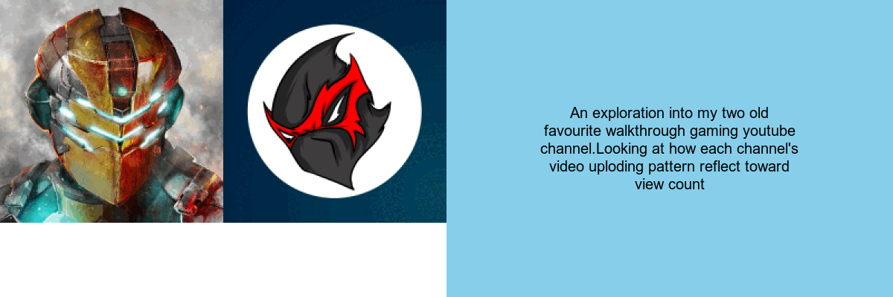

```{r setup, include=FALSE}
knitr::opts_chunk$set(echo = TRUE, message = FALSE, warning = FALSE, error = FALSE)
library(tidyverse)
library(magick)
youtube_data <- read.csv("https://docs.google.com/spreadsheets/d/e/2PACX-1vTDMq3r1wrqP8y2-8-QbdacsrMReIT5jQR_VgE0zG3NlKRVw89GY_UtiOdA2O6plbREAvYNFKUpQgvT/pub?output=csv")

```

```{css echo=FALSE}
body{
font-family: comic Sans MS;
font-size: 12pt;
}
pre {
background-color: #ADD8e6;
padding: 5px;
}
a{
color: #5ebccf:;
}
a:hover{
color: red;
}

h1{
color: #104176;
}
h2{
color: #104176;
}

h3{
color: skyblue;
}
```
## Introduction
* The two YouTube channels I have chosen are @theRadBrad and @TetraNinja. These two are gaming channels, whose primary content consists mostly of walkthrough gameplay. I have chosen these two channels because two channels were my favorite YouTubers when I was young, and since they have been on the platform for more than ~10 years, I was interested in creating visualizations through their YouTube statistical data. Two ideas before the visualization were: 1) comparison of color diversity within the thumbnail between two channels; and 2) relationship between the text included in the thumbnail and the image description of the content in the thumbnail.During the process of creating a visualization, i have chosen to focus on the variable date published to investigate its relationship with other variables over a period of time. I have mostly used geom_bar and geom_col when doing the exploration of data, because it's simple to represent the yearly change with other variables, and not much was available for categorical variables; thus, using geom_bar and col was mostly used throughout the investigation. One thing i tried but didn't work was trying to manipulate the data datepublished for each season. But if i changed the variables into numeric variables, the str_detect function detected 1 and 10 as the same, so distinguishing between winter and spring didn't work. Instead, i had to keep it as a string.

## Dynamic data story

* The data story incorporates various visualization techniques, including geom_lines, geom_jitter and geom_col to represent different aspect of the youtube data.The visualization are customized with chosen colour palettes, font style. Having consistant aesthetic choice of the graph. 

## Learning reflection 
* Module 4 was essnetially learning about expanding our knowledge of using the functions from {ggplot2} to create statistically significant and diverse plot. I found having strong in-depth understanding of geom function was important from Module 4. By understanding each geom parts and mapping aesthetic properties to variables, you are able to encode additional visualization and clearly express purpose of the study. Allowing for patterns, relationships, trends in the data and effectively convey the message to the viewer. Further pratice from {ggplot2} i wanted to explore was graphically present the plot in 3D action and statistically interactive plot would be interesting to learn further about.

## Appendix
```{r file='visualisations.R', eval=FALSE, echo=TRUE}

```

```{r file='data_story.R', eval=FALSE, echo=TRUE}

```
