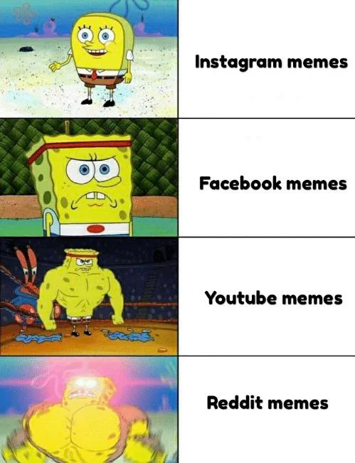
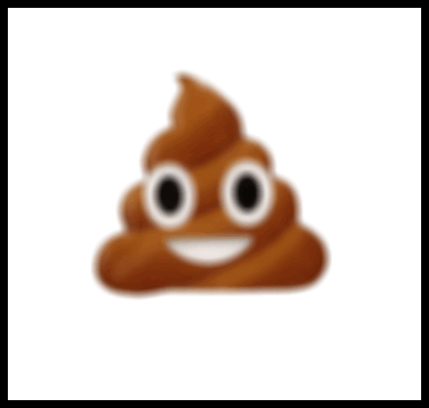

```{r setup, include=FALSE}
knitr::opts_chunk$set(echo=TRUE, message=FALSE, warning=FALSE, error=FALSE)
library(magick)
```

```{css}
body{
font-family: comic Sans MS;
font-size: 12pt;
}
pre {
background-color: #ADD8e6;
padding: 5px;
}
a{
color: #5ebccf:;
}
a:hover{
color: red;
}

h1{
color: #8070FE;
}
h2{
color: #104176;
}

h3{
color: #74E0D5;
}

```{r, echo=FALSE}
htmltools::img(src = knitr::image_uri(file.path(R.home("doc"), "html", "logo.jpg")), 
               alt = 'logo', 
               style = 'position:absolute; top:0; right:0; padding:10px;',
               width = "300px",
               heigth = "300px")              


```

## <b>Project requirements</b>
### Brief summary

* Link to my repo: <mark>https://github.com/ygl0405/Stat220</mark>
* Link to my Github: <mark>https://github.com/ygl0405</mark>
* When setting up GitHub repository I have used all the requirement needed for working with Github. As for using bold and italics fonts, i have used them under the headings to make impact impression on the title and emphasize what my main of the repository is going to contain. I have shared my instagram page, as to link into the other website :sweat_smile:. For using different type of bullet points, I've used unordered list to describe what people could expect from my stat 220 repository.As for ordered list i shared what i want to achieve from the community. Usage of GIF was included to make the introductory more interesting.

### Screenshot
 

## <b>My meme</b>


* The key component of the inspo meme was combined 8 square and the bold font for the words. Mainly followed the same structure with change in the picture and word displayed in the inspo meme.Instead of the 8 squares i have made 6 square meme with boarders around it.
```{r meme-code, eval=TRUE}
# first row  
low_quality<- image_read("https://cdn11.bigcommerce.com/s-vlbdy8qi9u/images/stencil/800x800/products/1594/4912/poopie_HiRes__46085.1526327416.jpg?c=2") %>%
  image_blur(10,30) %>%
  image_scale("x500" ) %>%
  image_border("black", "10x10") 

quality144p_text<- image_blank(width = 500,
                               height = 500,
                               color = "#FFFFFF") %>%
  image_annotate(text= "144p",
                 color = "#000000",
                 size= 80,
                 font= "Impact",
                 gravity = "center") %>%
  image_border("black", "10x10")
# second row
mid_quality<- image_read("https://cdn11.bigcommerce.com/s-vlbdy8qi9u/images/stencil/800x800/products/1594/4912/poopie_HiRes__46085.1526327416.jpg?c=2") %>%
  image_scale("x500") %>%
  image_border("black", "10x10")

quality1080p_text<- image_blank(width= 500,
                               height = 500,
                               color = "#FFFFFF") %>%
  image_annotate(text= "1080p",
                 color="#000000",
                 size= 80,
                 font= "Impact",
                 gravity = "center") %>%
  image_border("black", "10x10")

# third row 
high_quality<- image_read("https://cdn11.bigcommerce.com/s-im4uxbqc/images/stencil/1280x1280/products/279/709/IMG_4824_1__38929.1487800696.jpg?c=2") %>%
  image_scale("x373") %>%
  image_border("black", "10x10")

quality4k_text <- image_blank(width = 500,
                              height = 500,
                              color = "#FFFFFF") %>%
  image_annotate(text= "4k",
                 color="#000000",
                 size= 80,
                 font= "Impact",
                 gravity = "center") %>%
  image_border("black", "10x10")

# putting it all together
first_row<- c(low_quality,quality144p_text) %>%
  image_append()

second_row <- c(mid_quality,quality1080p_text) %>%
  image_append()
third_row <- c(high_quality, quality4k_text) %>%
  image_append()


#Meme putting it all together
my_meme<- c(first_row, second_row, third_row) %>%
  image_append(stack = TRUE)

my_meme
```

```{r animation-code, eval=FALSE}
#extra frame
cat_thumb<- image_read("https://i.pinimg.com/736x/93/a1/27/93a127cbbd82c491bfd7cd36a2e81b5b.jpg") %>%
  image_scale("x700")

#animation putting it all together

frames <- c(low_quality, mid_quality, high_quality, cat_thumb)

animated_gif <- frames %>%
  image_animate(fps=1)

image_write(animated_gif, "my_animated_gif.gif")


```



## <b>Creativity</b>
* Working on styling appearance of HTML, i have demonstrated changing the color and heading and sub-heading.I have used different color for sub heading and heading to differentiate each part.Feature outside from the class i have used in CSS was TOC feature.Also i have tried to included R logo into HTML for presentation. When hovering over the heading or any website link, the color changing as the cursor hover over the link. When recreating meme from the inspo meme, I've recreated the context from the original meme. On technical part, i have used some functions from magick package to make the boarder lines between each text box to make it more neat. image_blur function was used to represent the idea i wanted to present in the meme. 


## <b>Learning reflection</b>
* One important idea i have learned from the Module 1 was understanding how to use CSS and HTML to enhance my communication through visual presentation. Learning to use R markdown for web scrapping and visualizing through HTML was interesting for me to learn. Learning to create visual through using different modern technology was definitely interesting part for me especially CSS to develop HTML. I want to search more into make different visualization and make appealing web through CSS and explore other modern technologies such as Power BI or Tableu. Understanding to present data through using CSS was challenging, however it showed my different possibility i could implant on making web pages. 


