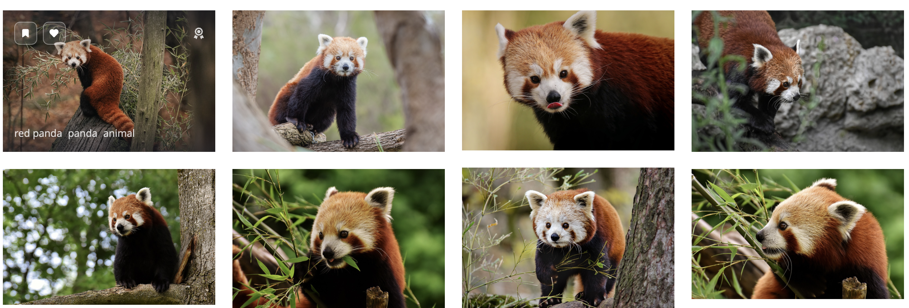

```{r setup, include=FALSE}
knitr::opts_chunk$set(echo = TRUE, message = FALSE, warning = FALSE, error = FALSE)
library(tidyverse)
library(magick)
photo_data <- read_csv("selected_photos.csv")
```

## Introduction
* Two word i have chosen for the photos on pixaby.com is "red panda". I choose two words red panda because i thought it would be interesting to see what photo would be generated from chosen word. 



* The images generated by pixabay are mostly presented as landscape view points. Each of the shots are focused on the red panda face.Most shots are from the habitat or nearby of where red panda might live, thus the colour consists mostly of forest green colour. Most pictures have average 160 likes and most viewed pictures of red panda have 82,222 total views. Most word tagged for the photo is panda, animal, nature and red panda. The size of photos are relatively same. 

```{r}
photo_data %>%
  select(pageURL) %>%
  knitr::kable()
```


## Key features of selected photos
```{r}
highest_download <- max(photo_data$downloads)

Mean_view <- round(mean(photo_data$views[photo_data$view_count == "High"]),2)

download_high <- median(photo_data$downloads[photo_data$view_count == "High"])

download_low <- median(photo_data$downloads[photo_data$view_count == "Low"])

unique_tag <- photo_data %>%
  pull(tags) %>%
  unique()

mean_view_tag <- mean(photo_data$views[grep(unique_tag, photo_data$tags)])

```

* Based on the statistics value, the tags with "little panda, red panda, cat-bear" had the highest downaldos of `r highest_download` `amongest the other different tag. 

* Among the randomly generated photos with red pandas, totals count of pictures which had higher value than mean of view-count was `r Mean_view`. 

* Photo with higher value compared to mean of view was counted as "high" else "low". The median of downloads for " high" views are `r download_high` compared to "low views" are `r download_low`. 

* The mean count for all unique tags calculated from the data is `r mean_view_tag`. This indicates that, on average, that tags with written upon with unique tags recieve approximately  receive `r mean_view_tag` views.

## Creativitiy
* Under the creative section part i have made a pie chart for distribution of view count. Since the categorical variable had only two value in view_count. Instead of bar graph, pie chart would be easy to see. Based on the lab i have used paste function to connect the names between each value. I have also created scatter plot in the creatvitiy section. Using the group_by and arrange function based on lab. Extra function i have used is facet_wrap to separate the panel between the img popularity for clear indication between the 2 values

## Learning reflection
* When doing this project, understanding and maximizing the features of function in order to collect data from JSON file. From forming JSON files into data frames and extracting the values and summarizing with appropriate function was important upon doing the assignment. Advancing the features required computate the data seemed really importnat concept for me, as process such as manipulating data frame into new set of data and mutating new variable to explore and have insight of the data seemed crucial part about this modlue.Based on learning about API and JSON data, i was interesed in learning more about what other storage besdie SQL is used to store the data.

## Appendix

```{r file='exploration.R', eval=FALSE, echo=TRUE}


```
